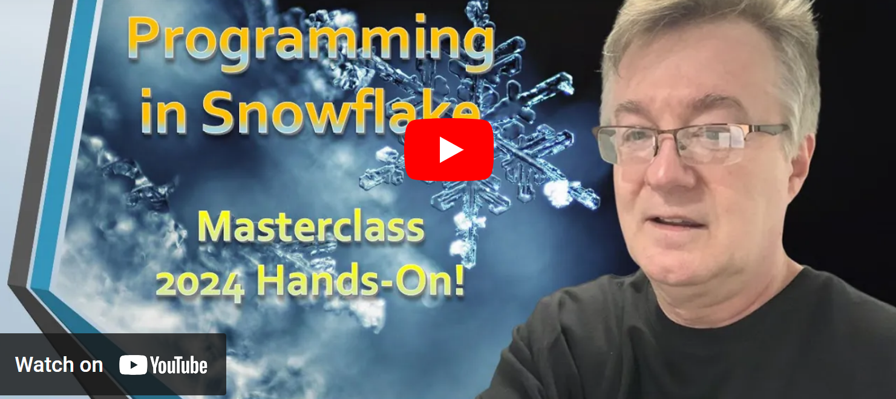

# Programming in Snowflake

All demo code for my Udemy course [**Programming in Snowflake Masterclass 2024 Hands-On!**](https://www.udemy.com/course/programming-in-snowflake/?couponCode=LOWEST-PRICE) - get for the LOWEST-PRICE on the previous link! Refer to individual sections for local documentation.

## Demo Project Setup

* **Install and configure Visual Studio Code (VSCode)**
* **Install the VSCode extension for Snowflake**
* **Clone this GitHub Repository:**

**`git clone https://github.com/cristiscu/programming-in-snowflake.git`**

* **Create and select a virtual environment (in new venv/ folder) for Python:**

**`~\AppData\Local\Programs\Python\Python39\python -m venv venv`**  
**`venv/scripts/activate`**  

* **Install all Python dependencies:**

**`pip install -r requirements.txt`**

* **[Install and configure SnowSQL](https://docs.snowflake.com/en/user-guide/snowsql-install-config)**
* **[Install and configure SnowCD](https://developers.snowflake.com/snowcd/)**
* **Test and debug local projects**

